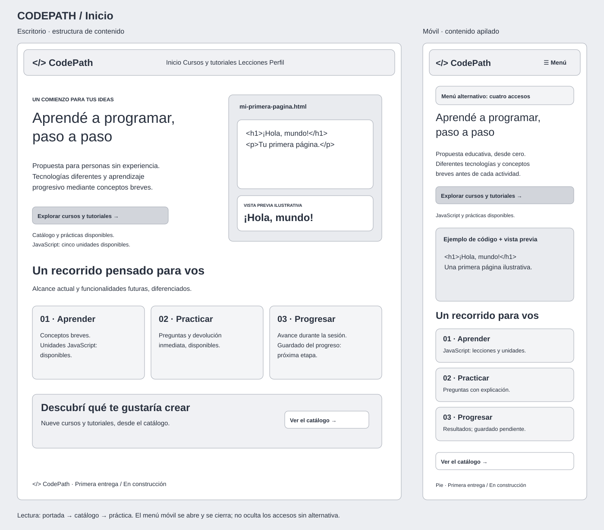
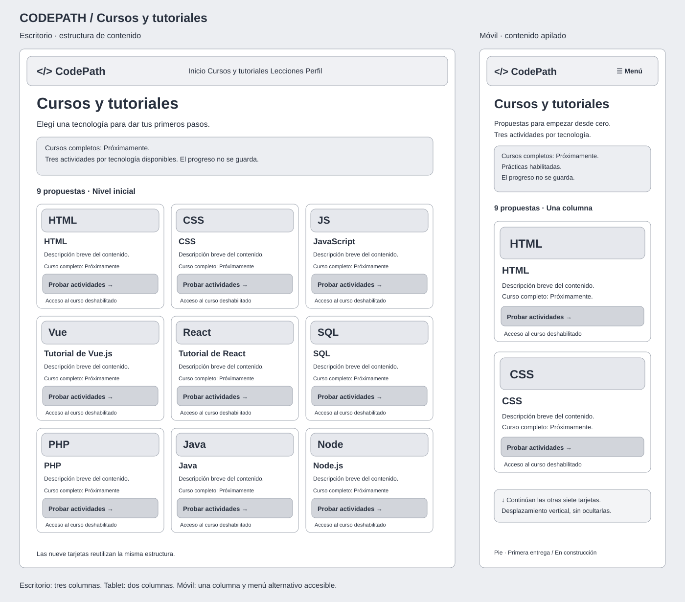

# Identidad visual y wireframes

## Paleta aplicada

- **Violeta #5B4BDB:** acción principal, foco e identidad. Organiza la interfaz y distingue los accesos para empezar.
- **Amarillo #FFC857:** detalles, invitaciones y acentos de logro. Siempre acompañado por texto oscuro #17243D, nunca texto blanco.
- **Azul oscuro #17243D:** títulos, texto principal y fondos de ejemplos de código.
- **Fondo #F7F8FF:** separa suavemente las zonas de contenido.
- **Superficies #FFFFFF:** tarjetas, encabezado y lectura de contenido.
- **Verde #218739:** token positive de Quasar para respuestas correctas.
- **Rojo #C62828:** token negative de Quasar para respuestas incorrectas.

La paleta se configura realmente en framework.config.brand de quasar.config.js. Los botones usan color="primary"; los indicadores correctos e incorrectos usan positive y negative. Los paneles de devolución utilizan variantes claras para el fondo y oscuras para el texto, además de íconos y mensajes explícitos.

Los fondos suaves de cada tecnología son decorativos; no indican disponibilidad. El estado se escribe junto al ícono correspondiente.

## Tipografías y jerarquía

Roboto para toda la interfaz, distribuida localmente mediante @quasar/extras, sin depender de Google Fonts. Títulos con peso alto, párrafos de lectura cómoda y textos auxiliares secundarios.

Consolas, Cascadia Code o Liberation Mono, con fallback monospace, para código y abreviaturas. El código mantiene espacios y saltos y puede ajustarse a pantallas pequeñas. El ejemplo de la portada se identifica como ilustrativo.

## Logo e íconos

BrandLogo.vue combina un recuadro violeta redondeado, el símbolo </> y el nombre CodePath. Los corchetes blancos aluden al código y la barra amarilla al paso entre ideas y construcción. El favicon utiliza el mismo símbolo en public/favicon.svg.

Se usa una única familia de íconos, Material Icons, incluida localmente. Los gráficos de tecnologías muestran abreviaturas legibles: HTML, CSS, JS, Vue, React, SQL, PHP, Java y Node. No dependen de nombres de íconos de marcas que podrían faltar. CourseCard también ofrece un fallback con las primeras letras del nombre.

Los SVG decorativos tienen aria-hidden; los enlaces al inicio se identifican como “CodePath, inicio”. Las tarjetas tienen encabezados asociados y sus acciones identifican la tecnología.

## Tarjetas y acciones

Tarjetas blancas con bordes sutiles, esquinas de 18 a 20 px y espacios internos amplios. La representación está arriba; luego aparecen nombre, descripción y estado; las acciones se alinean abajo.

Acciones principales: fondo violeta y texto blanco. Secundarias: borde y texto violeta. Las acciones pendientes están deshabilitadas y llevan candado y texto. Los botones principales tienen un mínimo de 48 px de alto; el acceso deshabilitado al curso completo tiene 44 px.

No hay barras de avance en las tarjetas del catálogo. UnitCard sí muestra la cantidad real de lecciones aprobadas en esa unidad y una barra proporcional. Disponible, Bloqueada y Completada se acompañan de texto e íconos. En la práctica, la barra indica cuántas preguntas del intento ya fueron respondidas.

El recorrido de JavaScript utiliza tarjetas horizontales con número, ícono, título, descripción, estado y acceso. En móvil, el botón ocupa el ancho completo debajo del contenido. Las lecciones tienen una lectura breve, código monoespaciado y acceso a ejercicios. Los estados usan como mínimo 14 px; los textos principales de las nuevas vistas, 16 px.

## Accesibilidad y adaptación

- Foco visible, enlace “Saltar al contenido” y foco al contenido después de navegar.
- Menú móvil con nombre, aria-expanded, aria-controls, cierre al navegar y cierre con Escape que devuelve el foco al botón.
- Radio buttons agrupados en un fieldset con legend, alternativas textuales y corrección anunciada mediante aria-live.
- Una respuesta incorrecta muestra el texto correcto y una explicación; no se identifica solo mediante rojo.
- Resultados con íconos, etiquetas y foco en el título.
- Preferencia de movimiento reducido respetada.
- Catálogo: una columna bajo 600 px; dos entre 600 y 1023 px; tres desde 1024 px.
- Encabezado con menú desplegable bajo 768 px; navegación completa desde 768 px.
- Inicio: dos columnas en escritorio y contenido apilado en móvil.

## Wireframes visuales

Los bocetos muestran estructura en escala de grises antes de la identidad visual. Cada archivo contiene distribución de escritorio y móvil:

En móvil, las tarjetas siguen en una lista vertical; no se ocultan propuestas. Los wireframes incluyen el menú alternativo y diferencian el acceso a prácticas de los cursos completos pendientes.

## Manual de identidad visual

El [manual PDF de 13 páginas](../output/pdf/CodePath_Identidad_Visual.pdf) desarrolla la construcción del logo, variantes, reservas, tamaños mínimos, usos incorrectos, muestras tipográficas, jerarquía, colorimetría y contraste. Incluye valores HEX, RGB, HSL y aproximaciones CMYK; estas últimas requieren ajuste con el perfil de la imprenta para una producción física.

Los [recursos de identidad](identidad/README.md) incluyen cuatro SVG con letras trazadas y el generador del manual. La referencia de la interfaz sigue siendo BrandLogo.vue, app.scss y la configuración de Quasar. Las reglas nuevas de reserva y tamaños impresos son pautas complementarias para futuras piezas.
